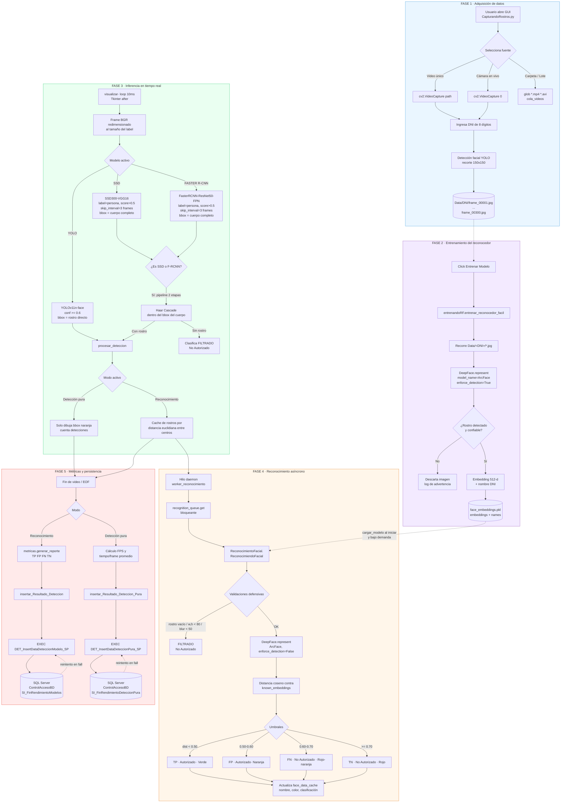
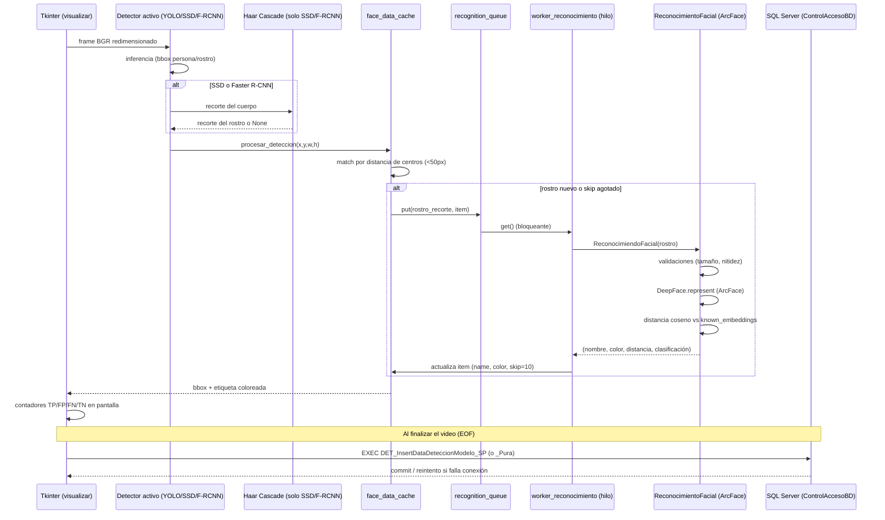
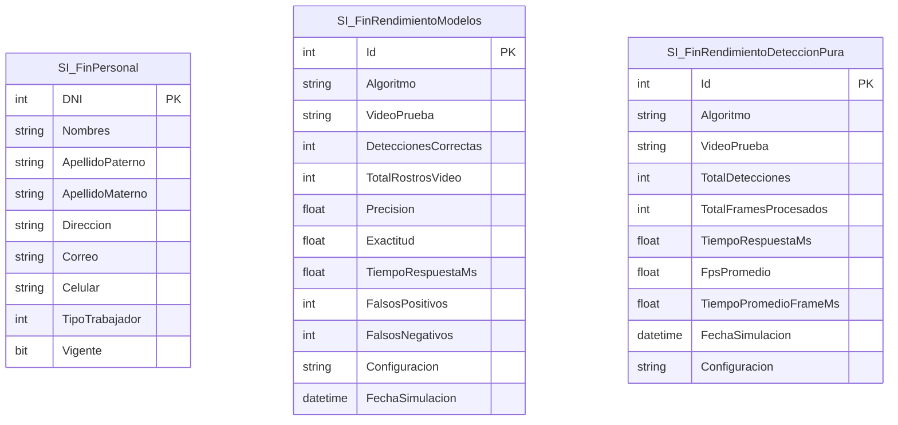

# Diagrama del Proceso de Desarrollo e Integración del Modelo
## Sistema de Reconocimiento Facial (Tesis)

Este documento describe, de manera detallada, el flujo completo del sistema: desde la captura de rostros, pasando por el entrenamiento del reconocedor (ArcFace/DeepFace), hasta la inferencia en tiempo real con los tres detectores intercambiables (YOLOv11-face, SSD300, Faster R-CNN), el pipeline en dos etapas, el hilo de reconocimiento asíncrono, el cálculo de métricas y la persistencia en SQL Server.

---

## 1. Visión general de módulos

| Módulo | Responsabilidad |
|---|---|
| `CapturandoRostros.py` | Orquestador principal (GUI Tkinter). Captura de video/cámara/lote, detección, hilo de reconocimiento, UI y flujo de estados. |
| `entrenandoRF.py` | Entrenamiento offline: recorre `Data/<DNI>/*.jpg`, genera embeddings ArcFace y serializa `face_embeddings.pkl`. |
| `ReconocimientoFacial.py` | Inferencia: carga `face_embeddings.pkl`, calcula distancia coseno contra los embeddings conocidos y clasifica TP/FP/FN/TN/FILTRADO. |
| `Conexion.py` | Conexión pyodbc a SQL Server (`ControlAccesoBD`). |
| `RegistroTrabajador.py` | CRUD de personal (formulario Tkinter) vía stored procedures. |
| `metricas.py` | Cálculo centralizado de Precisión, Recall, F1, Exactitud, Especificidad, tiempo/frame. |
| `check_gpu.py` | Diagnóstico de disponibilidad de CUDA y benchmark de Faster R-CNN. |
| `BD/01_MD.sql`, `BD/03_SP.sql` | Modelo de datos y stored procedures (SQL Server). |
| `tests/` | Suite de pruebas unitarias (conexión, detección, reconocimiento, métricas, benchmark). |

---

## 2. Diagrama general del pipeline (extremo a extremo)

---

## 3. Detalle Fase 1 — Captura de rostros (`CapturandoRostros.py`, `guardar_frame`)

1. El usuario elige fuente: **video único**, **cámara en vivo (DirectShow)** o **procesamiento por lote** (carpeta completa, ordenada alfabéticamente, con reanudación desde el video seleccionado).
2. `limite_imagenes` se adapta dinámicamente:
   - Video: `CAP_PROP_FRAME_COUNT` del archivo (fallback 300).
   - Cámara: fijo en 1000.
3. El usuario ingresa un **DNI de 8 dígitos** (validado con `.isdigit()` y `len == 8`) → crea `Data/<DNI>/`.
4. En cada frame, YOLO detecta el rostro; `guardar_frame()` recorta la caja, la reescala a **150×150 px** (`INTER_CUBIC`) y la guarda como `frame_%05d.jpg`.
5. Se actualiza el contador visual `Imágenes capturadas: X/N`.

## 4. Detalle Fase 2 — Entrenamiento (`entrenandoRF.py`)

1. Recorre cada subcarpeta de `Data/` (una por DNI).
2. Para cada imagen `.jpg/.jpeg/.png`, invoca `DeepFace.represent(model_name="ArcFace", enforce_detection=True)`.
3. Si DeepFace no logra detectar un rostro confiable, la imagen se descarta (log de advertencia), evitando contaminar el dataset de embeddings.
4. Acumula `known_embeddings` (vectores 512-d) y `known_names` (DNI asociado).
5. Serializa el resultado con `pickle` en `face_embeddings.pkl` — este archivo es el **modelo entrenado** que consume la fase de reconocimiento.

## 5. Detalle Fase 3 — Detección en tiempo real (tres backends intercambiables)

| Modelo | Framework | Objeto detectado | Umbral | Particularidad |
|---|---|---|---|---|
| **YOLO** (`yolo11n-face.pt`) | Ultralytics YOLOv11 | Rostro directo | conf ≥ 0.6 | Recorte = rostro, listo para ArcFace. |
| **SSD** (`ssd300_vgg16`) | Torchvision | Persona/cuerpo (label=1) | score > 0.5 | Requiere **pipeline en 2 etapas** (Haar Cascade) para extraer el rostro del cuerpo. Inferencia cada 3 frames (`_heavy_skip_interval`), con caché de detecciones entre saltos. |
| **Faster R-CNN** (`fasterrcnn_resnet50_fpn`) | Torchvision | Persona/cuerpo (label=1) | score > 0.5 | Igual que SSD: pipeline de 2 etapas + skip de frames. Carga asíncrona en hilo aparte (`cargar_modelo_en_background`) para no congelar la UI. |

**Pipeline en dos etapas (SSD/Faster R-CNN → Haar Cascade → ArcFace):**
Cuando el modelo activo detecta un *cuerpo completo*, `extraer_rostro_de_cuerpo()` aplica `haarcascade_frontalface_default.xml` dentro de ese bounding box para aislar el rostro (toma el más grande si hay varios). Si Haar no encuentra nada, el resultado se marca directamente como `FILTRADO / No Autorizado` sin llamar a ArcFace.

**Modos de operación (mutuamente excluyentes):**
- **Detección pura** (`modo_deteccion_pura`): solo mide velocidad/volumen (conteo, FPS, tiempo/frame). No llama a ArcFace.
- **Reconocimiento** (`modo_reconocerFacial`): además de detectar, identifica la identidad y clasifica TP/FP/FN/TN.

## 6. Detalle Fase 4 — Reconocimiento asíncrono (`worker_reconocimiento` + `ReconocimientoFacial.py`)

- Un **hilo demonio** (`threading.Thread`) consume una `queue.Queue()` para no bloquear el loop de UI (`visualizar()`, refrescado cada 10 ms).
- **Caché de identidad por posición**: cada rostro detectado se compara por distancia euclidiana de centros (`< 50 px`) contra `face_data_cache` para no reprocesar la misma cara en cada frame; usa un contador `skip` para espaciar las llamadas costosas a ArcFace.
- **Validaciones defensivas antes de invocar DeepFace**: rostro vacío, `w < 80 or h < 80`, o nitidez insuficiente (`cv2.Laplacian(...).var() < 50`) → clasificación inmediata `FILTRADO`.
- **Clasificación por umbral de distancia coseno** (`calcular_distancia_coseno`, ArcFace embeddings):

  | Distancia | Clasificación | Color UI |
  |---|---|---|
  | `< 0.50` | **TP** (Autorizado, alta confianza) | Verde |
  | `0.50 – 0.60` | **FP** (Autorizado, dudoso) | Naranja |
  | `0.60 – 0.70` | **FN** (No Autorizado, cercano al umbral) | Rojo-naranja |
  | `≥ 0.70` | **TN** (No Autorizado) | Rojo |

## 7. Detalle Fase 5 — Métricas y persistencia (`metricas.py`, `Conexion.py`, SQL Server)

**Cálculo de métricas** (`metricas.generar_reporte`):
`Precisión = TP/(TP+FP)`, `Recall = TP/(TP+FN)`, `F1 = 2·P·R/(P+R)`, `Exactitud = (TP+TN)/Total`, `Especificidad = TN/(TN+FP)`, `Tiempo/Frame = tiempo_total/frames`.

**Persistencia en SQL Server** (`ControlAccesoBD`, vía `pyodbc` + ODBC Driver 17):

- `_asegurar_conexion()` verifica la conexión (`SELECT 1`) y reconecta si se perdió, antes de cada inserción — con **reintento automático** en caso de fallo del `INSERT`.
- Modo *reconocimiento* → `EXEC DET_InsertDataDeteccionModelo_SP` → tabla `SI_FinRendimientoModelos` (algoritmo, video, aciertos, precisión, exactitud, FP, FN, tiempo, fecha).
- Modo *detección pura* → `EXEC DET_InsertDataDeteccionPura_SP` → tabla `SI_FinRendimientoDeteccionPura` (algoritmo, video, total detecciones, frames, FPS promedio, tiempo/frame).
- Módulo `RegistroTrabajador.py` gestiona altas/bajas/lectura de personal vía `DET_InsertDatosPersonal_SP`, `DET_VigenciaDatosPersonal_SP`, `DET_LeerDatosPersonal_SP` sobre la tabla `SI_FinPersonal`.

---

## 8. Diagrama de secuencia — un ciclo de reconocimiento sobre un frame

---

## 9. Notas de arquitectura relevantes

- **Desacoplamiento detección/reconocimiento**: la detección de caja (YOLO/SSD/F-RCNN) corre en el hilo de UI a 10 ms de refresco; el reconocimiento (costoso, ArcFace) corre en un hilo aparte consumiendo una cola, evitando congelar el video.
- **Optimización de modelos pesados**: SSD y Faster R-CNN solo infieren cada 3 frames (`_heavy_skip_interval`), reutilizando las últimas detecciones cacheadas en los frames intermedios; además se cargan en segundo plano (`threading.Thread`) la primera vez que se seleccionan en el combobox, mostrando un overlay "Cargando..." mientras tanto.
- **GPU/CPU**: `check_gpu.py` diagnostica CUDA; si hay GPU disponible, SSD y Faster R-CNN se mueven a `cuda` y usan `torch.amp.autocast` para inferencia mixta.
- **Resiliencia de BD**: toda inserción verifica la conexión antes de escribir y reintenta una vez reconectando si `pyodbc.Error` ocurre — pensado para sesiones largas de procesamiento por lote.
- **Modo lote (`cargar_carpeta_videos`)**: encola todos los videos `.mp4/.avi` de una carpeta desde el video seleccionado en adelante, preguntando una sola vez si el lote completo corre en modo reconocimiento o detección pura, y encadena automáticamente el siguiente video al finalizar cada uno (`iniciar_siguiente_video_de_cola`).
- **Pruebas** (`tests/`): cubren conexión a BD, detección, reconocimiento, cálculo de métricas y benchmarking — validando cada fase del pipeline de forma aislada.

---

## 10. Modelo de datos (resumen)

